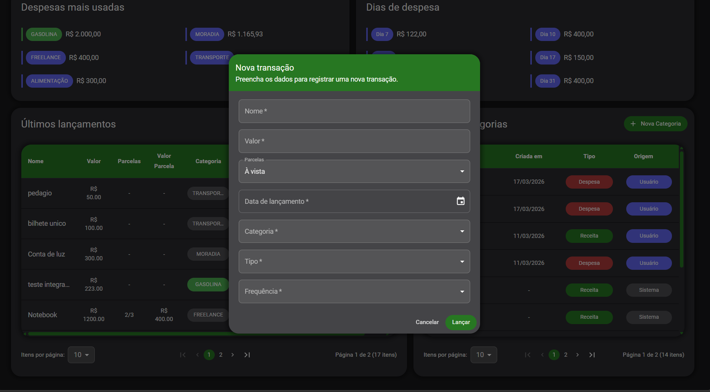
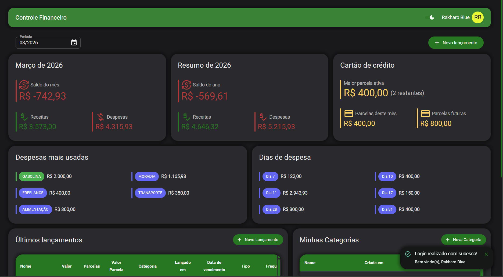
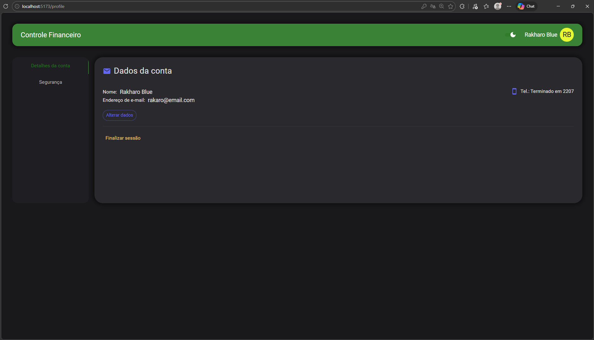
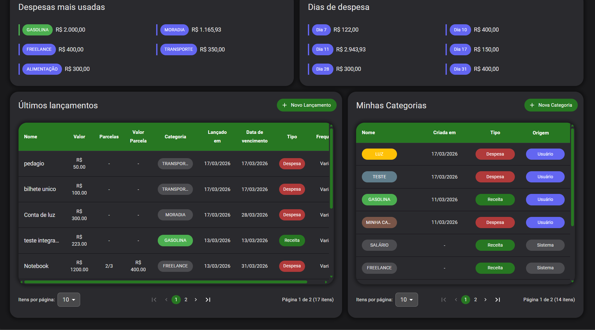

# Financial Control Web

Interface web para controle financeiro pessoal, permitindo gerenciamento de receitas, despesas, categorias e visualização de dados analíticos, com foco em experiência do usuário e validação robusta de formulários.

###Login


---

## Tecnologias

* React
* TypeScript
* Material UI (MUI)
* React Router
* React Query
* React-OAuth/Google
* React Hook Form
* Zod
* Axios
* IMask

---

## Estrutura do projeto

```
/src
  /api
    /axios         # Configuração do Axios

  /components
    /global        # Componentes reutilizáveis (BaseInput, BaseCard, etc)
    /layout        # Componentes referentes ao layout da aplicação, como AppLayout e TopBar

  /pages
    /login         # Tela de login e cadastro com integração com login google
    /dashboard     # Tela principal com dashboard e formulários integrados de transações e categorias
    /profile       # Tela de configuração do perfil do usuário, com opção de vínculo à conta google

  /services        # Funções de conexão com endpoints
  /interfaces      # Mapeamento de requisições e respostas de dados dos endpoints
  /hooks           # Hooks do reactQuery conectando com Services
  /context         # Contextos globais (UserProvider)
  /utils           # Schemas e helpers
  /theme           # Configuração global do tema do MUI

```

---

## Autenticação

### Funcionalidades

* Login com email e senha
* Login com Google
* Vinculação de conta Google


### Armazenamento

* Token JWT salvo no `localStorage`
* Injetado automaticamente via interceptor do Axios

---

## Comunicação com API

### Axios

* Instância centralizada do Axios
* Configuração de baseURL via variável de ambiente
* Interceptor para envio automático do token JWT
* Interceptor adiciona:

```
Authorization: Bearer <token>
```

---

## Tratamento de erros

* Captura erros do backend via:

```
error.response.data
```

* Exibe mensagens amigáveis para o usuário

---

## Formulários

### Validação

* Zod para schema validation
* React Hook Form para controle

### Features

* Mensagens de erro dinâmicas
* Campos controlados com `Controller`
* Integração com componentes customizados


### Formulário Transaction


---

## Componentes principais

### BaseInput

* Integra com React Hook Form
* Suporte a:

  * Máscara com IMask
  * Exibição de erro
  * Helper text

### BaseCard / BaseTabs

* Estrutura visual reutilizável
* Usados na tela de login

### BaseSelect

* Funcionalidade de busca e separação de opções

---

## UI/UX

* Tela de login com abas:
  * Login
  * Cadastro
* Suporte a imagem de fundo
* Feedback visual de erros
* Máscaras para inputs (ex: telefone)
* Tema claro/escuro
* Layout responsivo
* Tema global configurado com MUI para padronização visual e fácil manutenção
* Criação/Edição de Transações
* Criação/Edição de Categorias
* Dashboard com resumos de despesas
* Perfil com possibilidade de alteração de dados e senha


### Dashboard


### Profile


### Tables



---

## Integração com Backend

Este frontend consome a API do projeto Financial Control, responsável por:

- Autenticação (JWT + Google OAuth)
- Gestão de transações e categorias
- Cálculo de dados analíticos (dashboard)

---

## Como rodar

```bash
npm install
npm run dev
```

---

## Configuração

Crie um `.env`:

```
VITE_API_URL=http://localhost:8080
```

---

## Licença

Uso acadêmico / estudo
